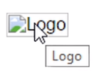
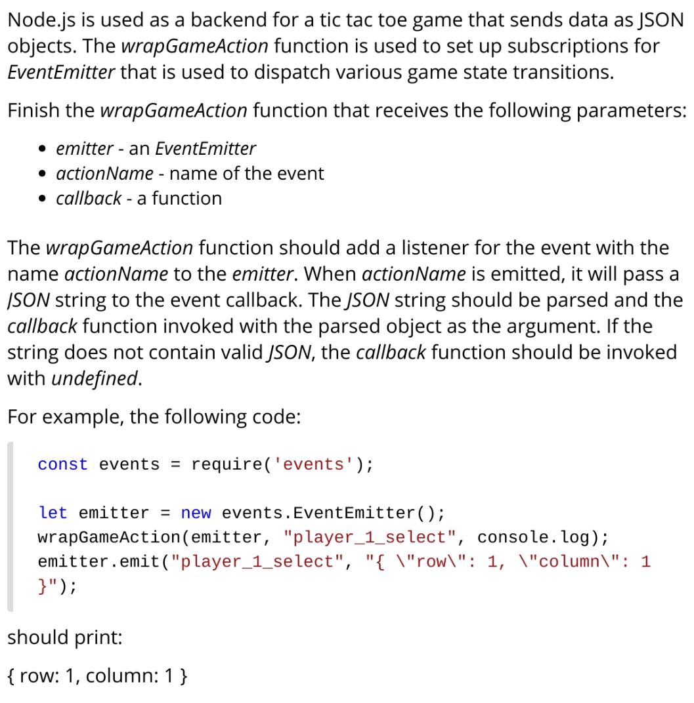
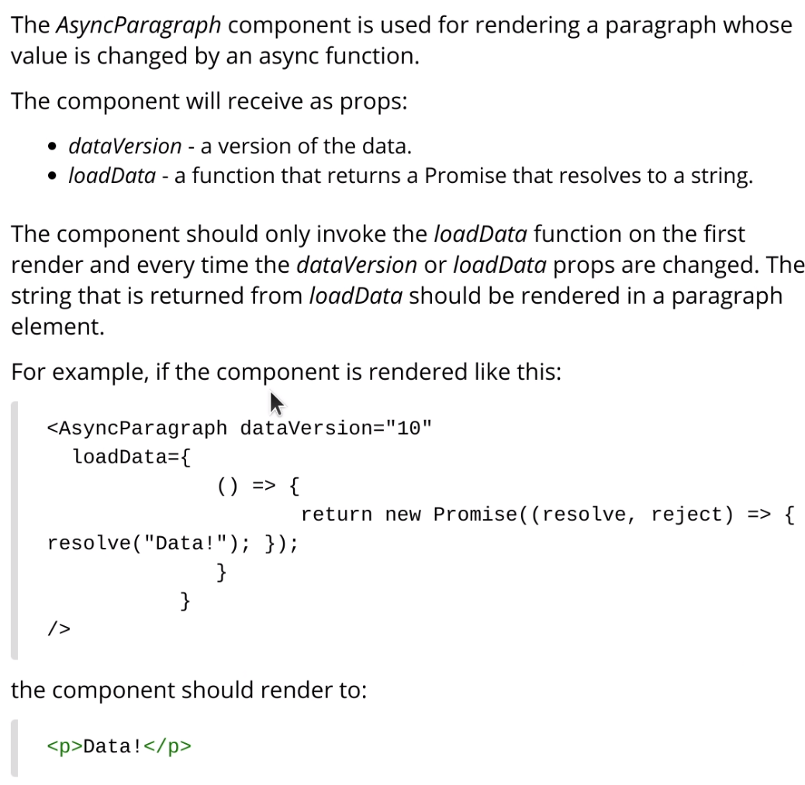
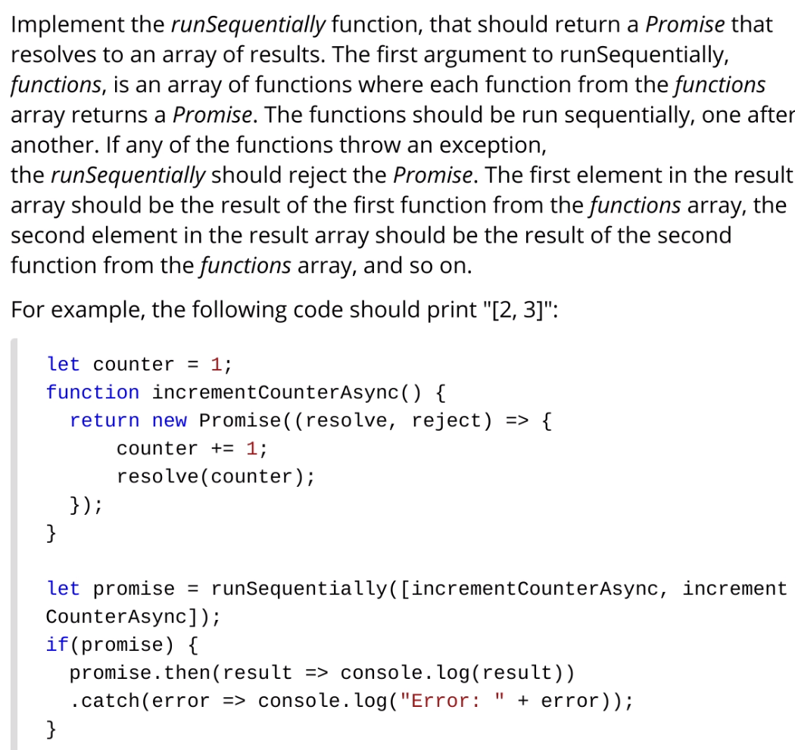

# These are NOT Leap's Interview Questions

__HTML/CSS, React, and Node.js__

Not my Leap (leaptodigital) Interview Answers. 100% and all tests pass.

Couple of notes:

- The formatting of the code isn't my fault, it's what they start you with.
- Each question has a time limit.
- The NodeJS questions use the ridiculously old version 12.
- The platform doesn't actually let you SEE any UI code running. So, for the React question, you can't actually look at it in a browser. For the anchor tag with a hover effect, you can't actually try it out. They recommend you use something else and paste your code back into the box, but because it's timed, you don't really have time to set that up AFTER you start the test (that was the situation I was in).

## Question 1 (HTML5, CSS3)

__You get 5 minutes to complete this.__

Modify the following HTML so that:

- If the image is not available, the text "Logo" should be displayed instead.
- When the mouse is over the image, a tooltip with the text "Logo" should be displayed.

See the following image for more details:



_This is an easy one that literally just tests the most basic HTML knowledge. Just add the `title` attribute for the tooltip, and the `alt` attribute for when the image doesn't load._

__Starting Code__

```html
<!DOCTYPE html>
<html>
    <head>
        <meta charset="utf-8">
        <title>Logo</title>
    </head>
    <body>
        
    </body>
</html>
```

__Final Code__

```html
<!DOCTYPE html>
<html>
    <head>
        <meta charset="utf-8">
        <title>Logo</title>
    </head>
    <body>
        
    </body>
</html>
```

__Test Cases (2)__

- Text instead of missage image: Correct answer
- Popup when mouse is over image: Correct answer

## Question 2 (NodeJS version 12)

__You get 15 minutes to complete this.__



_This one is easy if you understand how event emitters work, which you probably do without releasing it, since NodeJS heavily uses it. Just use `emitter.on()` to register an event handler. In the handler, make sure to use `JSON.parse` on the string, since the requirements say to do that. You can wrap the `JSON.parse` in a `try...catch` to do some error handling if it should fail. In this case the requirements say to invoke the `callback(undefined)`._

__Starting Code__

```js
function wrapGameAction(emitter, actionName, callback) {
    // Write your code here
}

const events = require('events');

let emitter = new events.EventEmitter();
wrapGameAction(emitter, "player_1_select", console.log);
emitter.emit("player_1_select", "{ \"row\": 1, \"column\": 1 }");

module.exports.wrapGameAction = wrapGameAction;
```

__Final Code__

```js
function wrapGameAction(emitter, actionName, callback) {
    // Write your code here
    emitter.on(actionName, (data) => {
        try {
            const parsed = JSON.parse(data)
            callback(parsed)
        } catch (ex) {
            callback(undefined)
        }
    })
}

const events = require('events');

let emitter = new events.EventEmitter();
wrapGameAction(emitter, "player_1_select", console.log);
emitter.emit("player_1_select", "{ \"row\": 1, \"column\": 1 }");

module.exports.wrapGameAction = wrapGameAction;
```

__Test Cases (4)__

- Example case: Correct answer
- The JSON can be parsed: Correct answer
- The JSON contains errors: Correct answer
- The same event is emitted multiple times: Correct answer

## Question 3 (HTML5, CSS3, Reactv16)

__You get 22 minutes and 30 seconds to complete this.__



_This one is easy for a React developer. It's just testing if you can use `useEffect()` and work with promises. They even tell you what the dependencies of `useEffect()` should be._

__Starting Code__

```js
// React is loaded and is available as React and ReactDOM
// imports should NOT be used
const AsyncParagraph = (props) => {
  // Write your code here
  return <p></p>;
};

document.body.innerHTML = "<div id='root' />";
ReactDOM.render(<AsyncParagraph dataVersion="10"
  loadData={ 
              () => { 
                     return new Promise((resolve, reject) => { resolve("Data!"); }); 
              } 
           }
/>, document.getElementById("root"));
setTimeout(() => console.log(document.getElementById("root").innerHTML), 300 );
```

__Final Code__

```js
// React is loaded and is available as React and ReactDOM
// imports should NOT be used
const AsyncParagraph = (props) => {
    // Write your code here
    const [data, setData] = React.useState('');
  
    React.useEffect(() => {
        props.loadData().then((loadedData) => {
            setData(loadedData)
        })
    }, [props.dataVersion, props.loadData])
  
    return <p>{data}</p>;
};

document.body.innerHTML = "<div id='root' />";
ReactDOM.render(<AsyncParagraph dataVersion="10"
  loadData={ 
              () => { 
                     return new Promise((resolve, reject) => { resolve("Data!"); }); 
              } 
           }
/>, document.getElementById("root"));
setTimeout(() => console.log(document.getElementById("root").innerHTML), 300 );
```

__Test Cases (3)__

- Example case: Correct answer 
- loadData is invoked on the first render and updates the text: Correct answer
- Updating dataVersion or loadData updates the text: Correct answer

## Question 4 (NodeJS version 12)

__You get 15 minutes to complete this.__



_This one was tricky. My solution technically works, but leaves a bit to be desired. I actually thought that the `for await ... of` loop wasn't supported in nodejs version 12, when actually it was released in version 10. If I could do this again, I'd have used that syntax. My solution could be improved for sure, and the code quality kind of stinks. This one requires a bit of explanation, because one of the test cases was confusing (for me)._

_Each function must be ran, and it's promise must be resolved/rejected PRIOR to executing the other functions. So, you cannot simply `functions.map()` all the functions to promises, and then `Promise.all` them, one test will still fail._

__Starting Code__

```js
async function runSequentially(functions) {
    // Write your code here
}

let counter = 1;
function incrementCounterAsync() {
    return new Promise((resolve, reject) => {
        counter += 1;
        resolve(counter);
    });
}
let promise = runSequentially([incrementCounterAsync, incrementCounterAsync]);
if (promise) {
    promise.then(result => console.log(result))
        .catch(error => console.log("Error: " + error));
}
module.exports.runSequentially = runSequentially;
```

__Final Code__

```js
async function runSequentially(functions) {
    // Write your code here
    const results = []
    for (const fn of functions) {
        const prom = fn()
        const result = await prom
        results.push(result)
    }
    return new Promise((resolve, reject) => {
        resolve(results)
    })
}

let counter = 1;
function incrementCounterAsync() {
    return new Promise((resolve, reject) => {
        counter += 1;
        resolve(counter);
    });
}
let promise = runSequentially([incrementCounterAsync, incrementCounterAsync]);
if (promise) {
    promise.then(result => console.log(result))
        .catch(error => console.log("Error: " + error));
}
module.exports.runSequentially = runSequentially;
```

__Test Cases (4)__

- Example case: Correct answer
- The functions are run sequentially: Correct answer
- The return value is correct: Correct answer
- The promise is rejected on error: Correct answer
